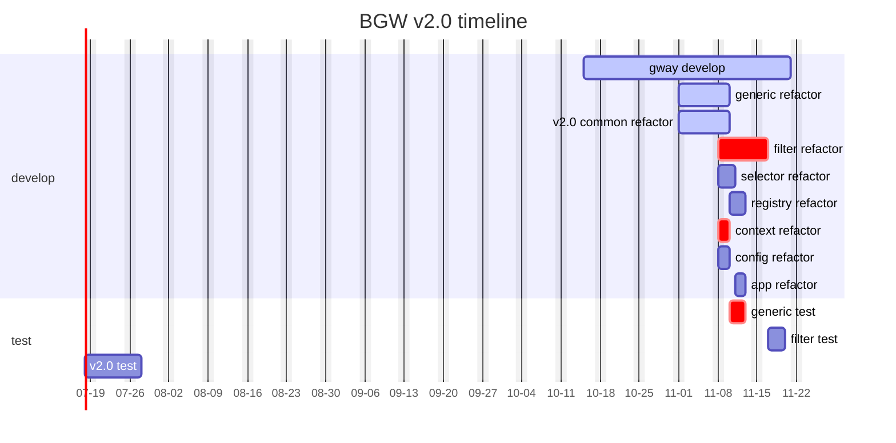

# gway specification

## 代码规范
1. 接口化。每个模块对外提供接口封装，应用依赖接口而不是实现。
2. 单测。每个模块单测100%覆盖率。
3. `option`化。需要定制的部分可以通过参数，`option`方式去定义，需要定制的内容较多的情况通过`option`定义，并提供`default option`实现。
4. 日志。需要提供详细日志的模块，要么通过原生`log`方式打印到`console`，要么定义`logger`，调用方制定`logger`实现，不允许模块打印日志文件。
5. env binding。作为环境区分第一选择的配置方式，`GWAY_XXX`。
6. 每个包独立`go.mod`，通过`go work use`增加模块。
7. 除了`gcore`模块可以被引用，其它模块之间不允许互相引用。
8. 模块依赖部分都只依赖接口，而不是实现，`依赖反转`方式降低依赖。
9. comments. english is the only choice.
10. Law of Demeter：只导出外部会使用的方法，结构。

# refactor steps
## step.1
0. implement: alert, consumer(hdts,kafka), geo, etcd, nacos, openapi, user, s3, symbol(TBC), http, log, trace... modules
1. unit test 80%. 
2. golint 100%.
3. provide interface for each module.
4. involve interface for each module.
5. env & option, params inject.

## step.2
1. use gway instead of local module.
2. refactor registry & discovery. merge functionality.
3. refactor filter, provide construct instead of instance.
4. refactor context implement.

## step.3
1. remove bat, refactor app.
2. add more log details, metrics, trace.
3. clean up tools, cmd.
4. refactor config: use toml instead of yaml (readability), use global one app config struct.

## BGW v2.0 timeline
